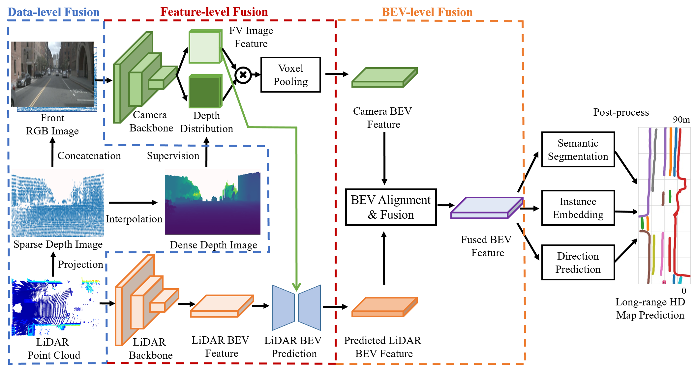
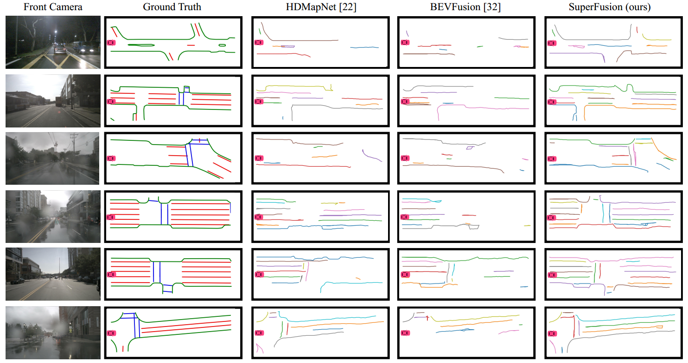

# SuperFusion

This repository contains the implementation of the paper:

**SuperFusion: Multilevel LiDAR-Camera Fusion for Long-Range HD Map Generation**

[Hao Dong](https://sites.google.com/view/dong-hao/), Xianjing Zhang, Jintao Xu, Rui Ai, Weihao Gu, Huimin Lu, [Juho Kannala](https://users.aalto.fi/~kannalj1/) and [Xieyuanli Chen](http://xieyuanli-chen.com/) 

[Link](https://arxiv.org/abs/2211.15656) to the arXiv version of the paper is available.

Pipeline overview of SuperFusion. Our method fuses camera and LiDAR data in three levels: the data-level fusion fuses depth information from LiDAR to improve the accuracy of image depth estimation, the feature-level fusion uses cross-attention for long-range LiDAR BEV feature prediction with the guidance of image features, and the BEV-level fusion aligns two branches to generate high-quality fused BEV features. Finally, the fused BEV features can support different heads, including semantic segmentation, instance embedding, and direction prediction, and finally post-processed to generate the HD map prediction.

## Abstract
High-definition (HD) semantic map generation of the environment is an essential component of autonomous driving. Existing methods have achieved good performance in this task by fusing different sensor modalities, such as LiDAR and camera. However, current works are based on raw data or network feature-level fusion and only consider short-range HD map generation, limiting their deployment to realistic autonomous driving applications. In this paper, we focus on the task of building the HD maps in both short ranges, i.e., within 30 m, and also predicting long-range HD maps up to 90 m, which is required by downstream path planning and control tasks to improve the smoothness and safety of autonomous driving. To this end, we propose a novel network named SuperFusion, exploiting the fusion of LiDAR and camera data at multiple levels. We use LiDAR depth to improve image depth estimation and use image features to guide long-range LiDAR feature prediction. We benchmark our SuperFusion on the nuScenes dataset and a self-recorded dataset and show that it outperforms the state-of-the-art baseline methods with large margins on all intervals. Additionally, we apply the generated HD map to a downstream path planning task, demonstrating that the long-range HD maps predicted by our method can lead to better path planning for autonomous vehicles.

## Code
Coming soon!

## Long-range HD map generation on nuScenes dataset

## Citation
If you use our implementation in your academic work, please cite the corresponding [paper](https://arxiv.org/abs/2211.15656):

	@article{dong2022SuperFusion,
		author   = {Hao Dong and Xianjing Zhang and Jintao Xu and Rui Ai and Weihao Gu and Huimin Lu and Juho Kannala and Xieyuanli Chen},
		title    = {{SuperFusion: Multilevel LiDAR-Camera Fusion for Long-Range HD Map Generation}},
		journal  = arxiv,
		eprint   = {2211.15656},
		year     = {2022},
	}
